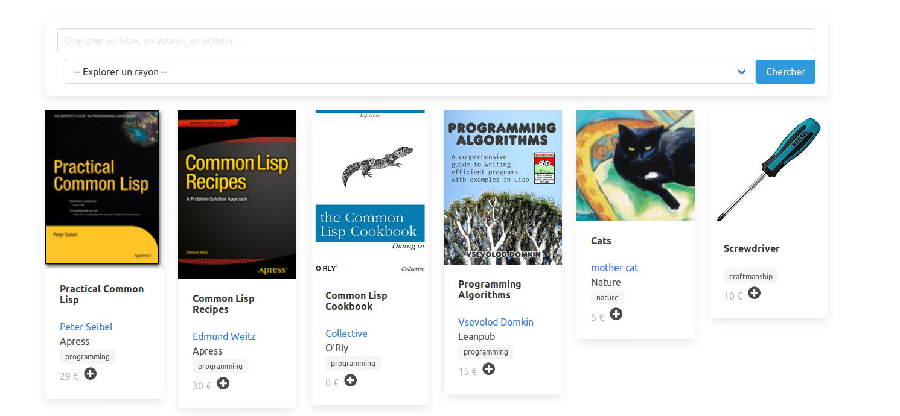

<p>
  <h3 align="center"> ABStock </h3>
  <h2 align="center"> Catalogue and commands online </h2>
</p>

<p align="center">
  <a href="http://abstock.gitlab.io"><b>Homepage</b></a> |
  <a href="https://abstock.gitlab.io/#/en/install"><b>Install</b></a> |
  <a href="https://framasphere.org/people/4ac5fae0bed90133a3ed2a0000053625"><b>Blog</b></a> |
  <a href="https://framavox.org/g/V6oiDr8Y/abelujo"><b>Forum</b></a> |
  <a href="https://www.patreon.com/abelujo"><b>Support us on Patreon</b></a> |
  <a href="https://liberapay.com/vindarel/donate"><b>Support us on Liberapay</b></a> |
  <a href="https://ko-fi.com/vindarel"><b>Buy me a coffee!</b></a> |
  <a href="/README_fr.md">Français</a>

  Clients can now discover your stock and shop online.

</p>

ABStock was developed during the global lock-down to help a bookshop
keep an activity and a link with its clients. It proved 100%
useful. You can have a site on the same model.

[Install it yourself](/docs/en/install.md) or ask us. Contact us at `contact@abelujo.cc`.

The website features by default the following pages, all customizable:

- a welcome screen, with:
  - the bookshop's information,
  - a search form,
  - a pre-selection of the books to showcase,
- a form to start searching books. A visitor can search by title, authors, publisher, shelf and ISBN(s).
- a shopping basket, for visitors to add books in
- a confirmation form, which sends the command by email to the shop owner,
- a special page to showcase a selection.

Here's how searching the stock looks like:


ABStock can load data from several places:

- by default, it connects to the [Abelujo](http://abelujo.cc/)
database. Abelujo is a free software for bookshops, that manages
inventories, sells, and the like. The database is loaded in memory at
startup, doesn't access it afterwards, and is synced several times a
day.
- it can load data stored in a simple txt format (see
  `cards-example.txt`). You can define books, or other products:



Interested? Please get in touch.

<a href='https://ko-fi.com/K3K828W0V' target='_blank'></a>

### Other features

- translate URLs ("/book/<slug>" or "/livre/<slug>")
- redefine anything with the pre- and post-config files, written in the programming language of the application (Lisp)

## Install

ABStock is known to work on:

- SBCL
- CCL


### Quick install on Debian Buster 10

update: you can try a self-contained binary for Debian Buster. [Download it here](https://gitlab.com/vindarel/abstock/-/jobs/artifacts/master/raw/abstock?job=build). Download it and run it with

    ./abstock

You do *not* need to install a Lisp implementation.
If you use it, please give us feedback [here](https://gitlab.com/vindarel/abstock/-/issues/8). Thanks!


Here's the universal recipe to run ABStock from sources:

```bash
# create a user for abstock or reuse the user of abelujo
apt install rlwrap sbcl cl-quicklisp git make
git clone https://gitlab.com/vindarel/abstock.git
cd abstock
# Copy or ln you db.db sqlite from abelujo
ln -s /home/abelujo/repo/db.db db.db

sbcl --load /usr/share/cl-quicklisp/quicklisp.lisp --eval '(quicklisp-quickstart:install)' --eval '(ql:add-to-init-file)' --eval '(quit)'
# or /usr/share/common-lisp/source/quicklisp/quicklisp.lisp on Debian 10.
make deps
# install it and run it with
make run
# aka
# rlwrap sbcl --load run.lisp --eval '(in-package :abstock)'
# use ctrl d to exit
```

### Quick install on a Raspberry Pi

SBCL lacks thread support on ARM 32 bits so we'll use Clozure Common
Lisp. It's easy to install and its compilation times are stellar.

```bash
# in root:
cd /usr/local/src/
wget https://github.com/Clozure/ccl/releases/download/v1.11.5/ccl-1.11.5-linuxarm.tar.gz
tar -xvze ccl-1.11.5-linuxarm.tar.gz
cp ccl/scripts/ccl /usr/local/bin/ccl
rm ccl-1.11.5-linuxarm.tar.gz

# in normal (abstock) user:
# ensure Quicklisp is installed:
ccl -l /usr/share/common-lisp/source/quicklisp/quicklisp.lisp -e '(quicklisp-quickstart:install)(ql:add-to-init-file)(ccl:quit)' -b
ccl --load run.lisp -e '(in-package :abstock)'
# to quit: (ccl:quit) or C-d
```

## Deployment

You can run the app as a script:

    rlwrap sbcl --load run.lisp --eval '(in-package :abstock)'

or run the binary:

    ./abstock

If you use the script, you are landed into the Lisp REPL. You can
inspect and update the application from there. See `(help)`. You can
actually do anything, including installing new Quicklisp
libraries. You can connect to the running instance from home through
SSH.

HTML changes are automatically taken up by the server. (you can switch
this off, this Djula's documentation).


### Systemd

```
[Unit]
Description=Abstock

[Service]
Restart=on-failure
WorkingDirectory=/home/abstock/repo
ExecStart=/usr/bin/sbcl --load run.lisp --eval '(in-package :abstock)'
User=abstock  # or an existing user

[Install]
WantedBy=multi-user.target
```

then:

    systemctl start abstock

to see the logs:

    journalctl -u abstock.service [--since today] [--no-pager] [-o json-pretty] [-f]

use `-f` to follow the logs as they are written.


## Issues and feature requests

Issue tracker: https://gitlab.com/vindarel/abstock/-/issues

GitHub mirror: https://github.com/vindarel/ABStock

Known TODOs:

* admin panel
* [X] read products data from a TXT, CSV or a JSON file
* i18n / remove a few still hardcoded words
* online Stripe payments
* simple stats

## Licence

AGPLv3

---

Lisp?! Oh yes, Lisp.

* https://lisp-journey.gitlab.io/pythonvslisp/
* https://lisp-lang.org/success/
* https://common-lisp.net/
* https://github.com/CodyReichert/awesome-cl
* https://lispcookbook.github.io/cl-cookbook/
