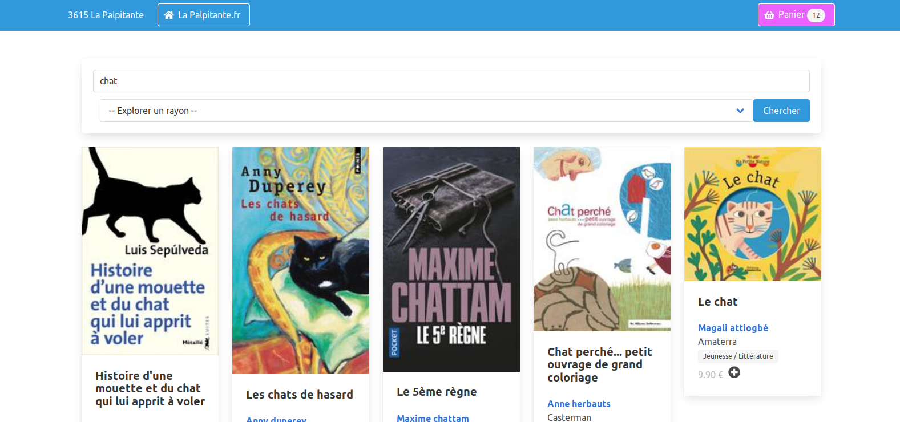

  <h3 align="center"> ABStock </h3>
  <h2 align="center"> Your catalogue online </h2>

  <a href="https://gitlab.com/vindarel/abstock"><b>Homepage</b></a> |
  <a href="https://gitlab.com/vindarel/abstock#install"><b>Install</b></a> |
  <a href="https://framasphere.org/people/4ac5fae0bed90133a3ed2a0000053625"><b>Blog</b></a> |
  <a href="https://framavox.org/g/V6oiDr8Y/abelujo"><b>Forum</b></a> |
  <a href="https://liberapay.com/vindarel/donate"><b>Support us</b></a> |
  <a href="/README_fr.md">Français</a>

  Clients can now see your books and pass command.

Here's how searching the stock looks like:

The website features:

- a welcome screen, with:
  - the bookshop's information,
  - a search form,
  - a pre-selection of the books to showcase,
- a form to start searching books. A visitor can search by title, authors, publisher, shelf and ISBN(s).
- a shopping basket, for visitors to add books in
- a confirmation form, which sends the command by email to the shop owner,
- a special page to showcase a selection.

ABStock connects by default to the [Abelujo](http://abelujo.cc/)
database. Abelujo is a free software for bookshops, that manages
inventories, sells, and the like.

The database is loaded in memory at startup, doesn't access it
afterwards, and is synced several times a day.

Interested? Please get in touch.

## Install

ABStock is *libre* software, you can download it, use it, modify it
and redistribute for free. We can also host it for you. Get in touch!

Here's how to install it on your server.

Install SBCL:

    apt install sbcl rlwrap

Install Quicklisp, as explained here: https://lispcookbook.github.io/cl-cookbook/getting-started.html#install-quicklisp

There is one missing dependency in Quicklisp that you have to clone in ~/quicklisp/local-projects:

- https://github.com/mmontone/cl-sentry-client (it is actually optional, I accept a PR to make it optional in the .asd)

Clone the reposity:

    git clone https://gitlab.com/vindarel/abstock

## Run

There are two possibilities.

The first one is to run the app like this:

    make run
    # aka:
    # rlwrap sbcl --load run.lisp

When it is run for the first time, it will install missing
dependencies. Finally, it will print that the webserver was started
and is listening on a given port.

With that method, we are dropped into the Lisp interactive REPL, so we can
interact with the running application. This is useful to reload settings and
such. You can reload all settings with `(load-init)`.

The second method is to use an executable.

Download/build the binary (see below) and run it:

    ./abstock

You can change setings with those environment variables:

* the application port:

    AB_PORT=9999 sbcl --load run.lisp

* the location of the configuration file:

    CONFIG=../path/to/config.lisp make run

## Configure

You can overwrite various parameters and texts:

- the contact information (two phone numbers, email…)
- your SendGrid API key
- the simple anti-spam validation form question (and answer)
- the welcome texts
- the shopping basket top text
- etc

See all available settings in `config-example.lisp`.

Write your in `config.lisp` at the project root.

~~~lisp
(setf *port* 9889)

(setf *contact-infos*
  '(:|phone| "06 09 09 09 09"
    :|email| "me@test.fr"))

;; SendGrid config:
(setf *email-config*
   '(:|sender-api-key| "api-key"
     :|from| "your@mail.com"))

;; Simple anti-script-kiddy question for the validation form:
(setf *secret-question* "stupid question")
(setf *secret-answer* "answer")
~~~

## Develop

Install as shown above.

To build the binary, do:

    make build

To develop in Slime, `load` the .asd (C-c C-k) and quickload the application with

    (ql:quickload :abstock)

Start the app:

    (in-package :abstock)
    (start)  ; optional :port 9999 argument.

The UI uses the [Bulma](https://bulma.io) CSS framework.

## Deploy

Use a user's configuration file:

    ln -s ../path/to/user/config-user.lisp config.lisp

Use **Sentry**: copy your DSN in ~/.config/abstock/sentry-dsn.txt. (currently, use the "deprecated" DSN).

## Issues and feature requests

Issue tracker: https://gitlab.com/vindarel/abstock/-/issues

## Licence

GPLv3
