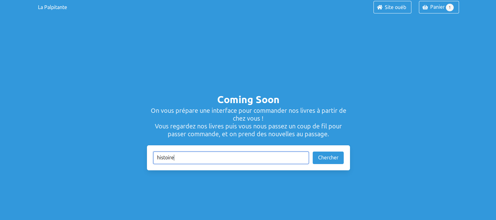
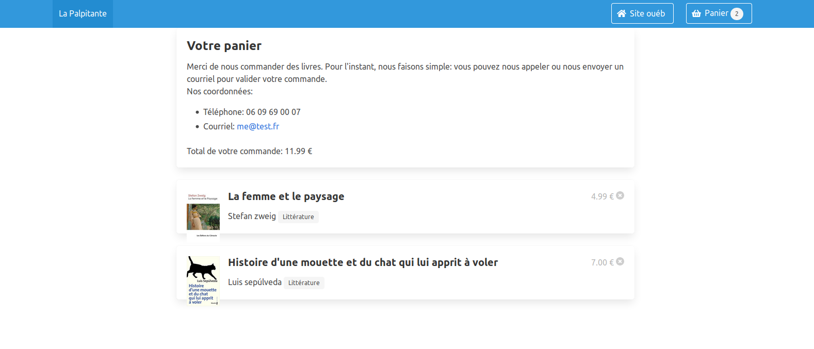

## ABStock: view your books online

Clients can see your books online, search your stock, and select them
in a basket.

It uses the [Abelujo](http://abelujo.cc/) database (or a copy of
it). You must have done an inventory with Abelujo before (or, we can
override a couple functions that are supposed to query the DB).

The database is loaded in memory at startup and doesn't access it
afterwards.

**disclaimer**: this is an alpha project done in haste to help an
actual bookshop and many things are missing.

The welcome screen:



Searching the stock:


Seeing one's shopping basket:



Interested? Please get in touch.


## Config

Example `~/.abstock.lisp`:

~~~lisp
(setf *port* 9889)

(setf *contact-infos*
  '(:|phone| "06 09 09 09 09"
    :|email| "me@test.fr"))
~~~

## Develop

Install SBCL:

    apt install sbcl

install Quicklisp (see [Cookbook: getting started](https://lispcookbook.github.io/cl-cookbook/getting-started.html))

build the binary:

    make build

then simply run it:

```
./abstock

Reading the DB...
Done. 3517 cards found.
Starting the web server on port 9889
Ready. You can access the application!

86.210.212.58 - [2020-04-07 19:56:28] "GET / HTTP/1.1" 200 3903 "-" "Mozilla/5.0 (X11; Ubuntu; Linux x86_64; rv:69.0) Gecko/20100101 Firefox/69.0"
```

The UI uses the [Bulma](https://bulma.io) CSS framework.

## Licence

GPLv3
